 

   

# Projet plug-in-pool 2023

- [Projet plug-in-pool 2023](#projet-plug-in-pool-2023)
  - [Documentation du code](#documentation-du-code)
  - [Recette](#recette)
  - [Versions](#versions)
    - [0.2](#02)
    - [0.1](#01)
  - [Annexes](#annexes)
    - [Blackball](#blackball)
      - [Casse](#casse)
      - [Fautes](#fautes)
      - [Fin de jeu](#fin-de-jeu)
  - [Auteurs](#auteurs)

---

Le système Plug in Pool est un système numérique permettant de jouer une partie de [Blackball](#blackball) (parfois appelé billard anglais, billard pool ou 8 pool).

Le système Plug-in-Pool est décomposé en trois modules :

- Module de détection des billes (Détection-POOL EC)​ : le billard est équipé de capteurs permettant de détecter l’empochage et la couleur d’une bille

- Module de gestion de partie (Mobile-POOL IR)​ : les joueurs paramètrent et lancent la partie à partir d’une application sur un terminal mobile (sous Android)

- Module de visualisation de partie (Écran-POOL IR)​ : le déroulement de la partie est affiché sur un écran de télévision.

## Documentation du code

https://btssn-lasalle-84.github.io/plug-in-pool-2023/

## Recette

| Fonctionnalité (Android)                         | Oui | Non |
| ------------------------------------------------ |:---:|:---:|
| Configurer une manche                            |  X  |     |
| Jouer une manche et afficher son déroulement     |  X  |     |
| Enregistrer les données de jeu                   |  X  |     |
| Afficher les statistiques des manches effectuées |     |     |
| Communiquer entre les modules                    |  /  |  /  |

## Versions

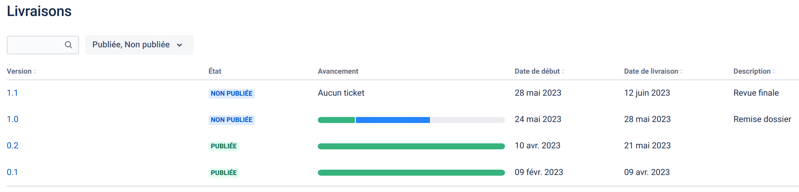

### 0.2

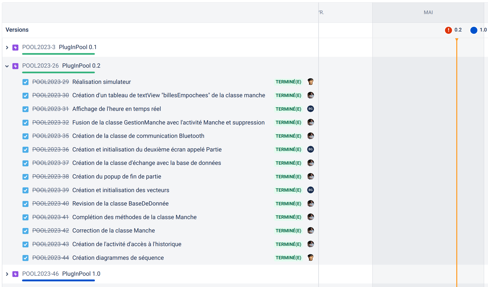

- Android :

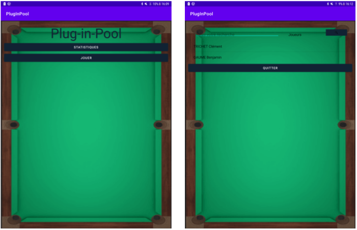

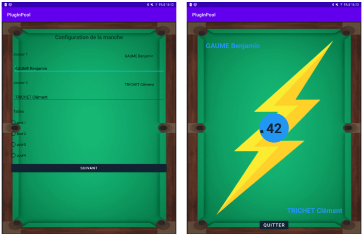

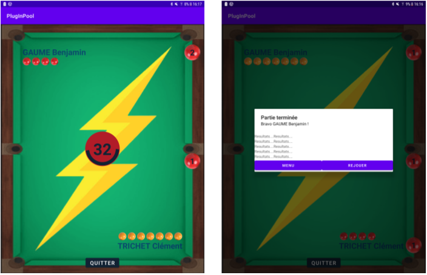

- Qt :

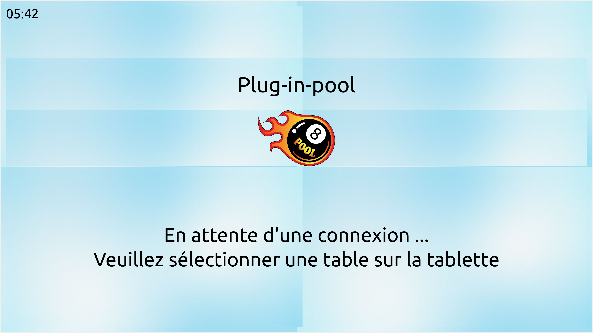

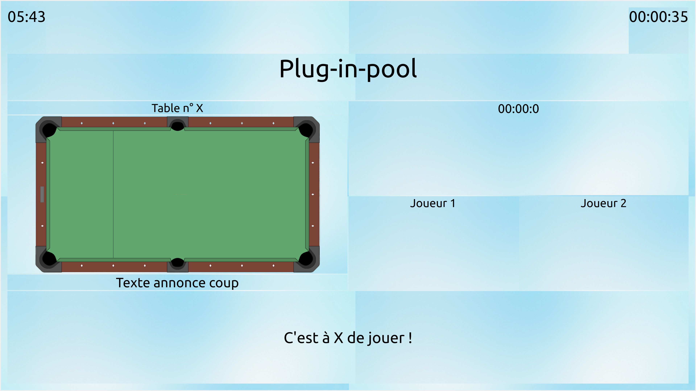

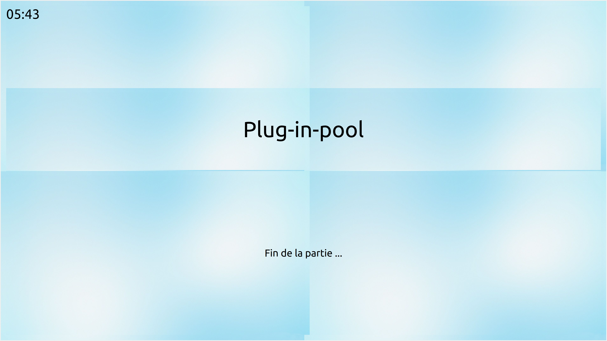

### 0.1

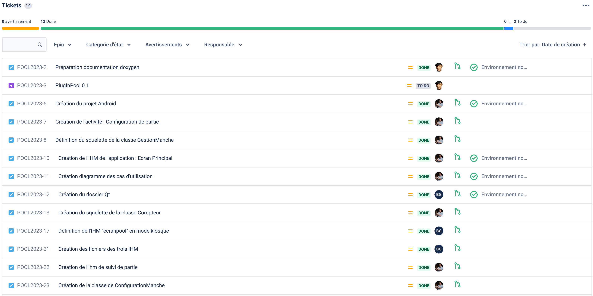

- Android :

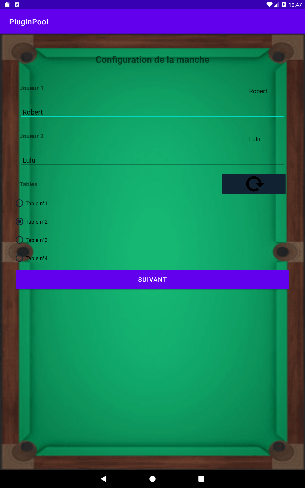

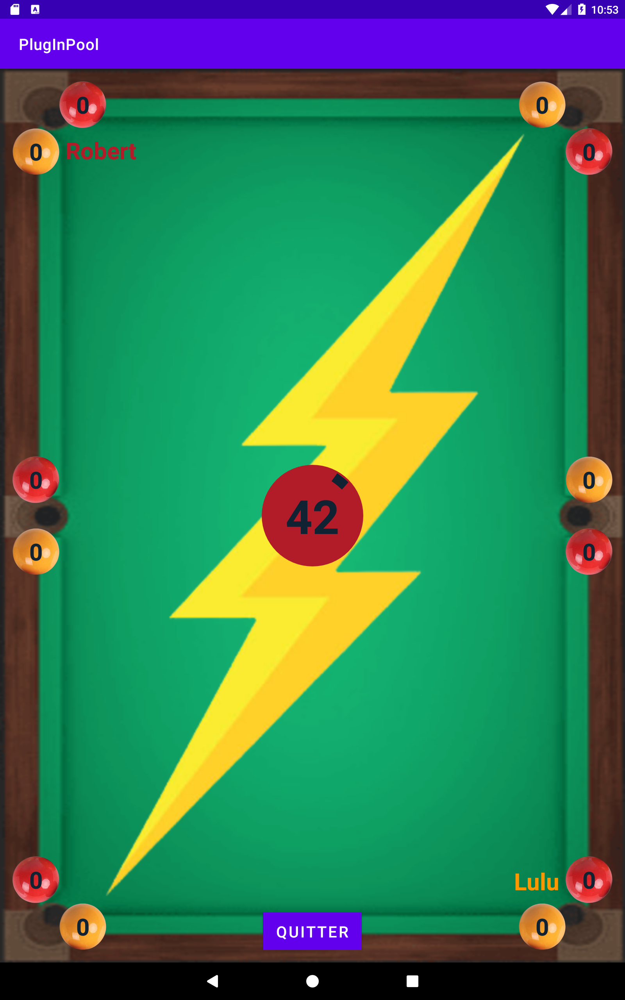

- Qt :

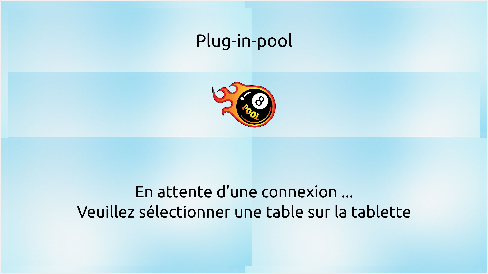

---

## Annexes

### Blackball

Le Blackball ou 8 pool, est un jeu de billard à deux joueurs, qui se déroule sur une table rectangulaire à poches avec 14 billes de couleur (7 rouges et 7 jaunes), une bille noire et une bille d'impact blanche. Les joueurs jouent uniquement les billes de leur groupe : les jaunes ou les rouges. Si un joueur empoche une de ses billes, il est autorisé à  rejouer. La partie est gagnée par le joueur qui, après avoir empoché les 7 billes de sa couleur, empoche la bille noire.

#### Casse

Les billes sont rassemblées en triangle et disposées de manière prédéfinie (motif "en J"). La noire doit se trouver placée (sur la mouche) à l’intersection des 2 diagonales entre les poches du bas et celles du milieu (côté opposé à celui du rectangle de départ).

La casse est considérée valide si une bille de couleur est empochée, ou si deux billes ou plus traversent la ligne corde centrale (ligne virtuelle reliant les deux poches centrales). Le cas échéant, ou si la blanche est empochée, le triangle est reformée, et la casse est effectuée par le second joueur. Si la bille noire est empochée, le triangle est reformé sans faute et le joueur casse une nouvelle fois.

La couleur des billes est déterminée par la première bille empochée, si deux billes sont empochées en même temps, de couleurs différentes, le joueur rejoue sans que la couleur des billes de son groupe soit déterminée.

#### Fautes

Lorsque le joueur commet une des fautes suivantes, le joueur adverse dispose de deux coups :

- La bille blanche est empochée (y compris à la casse) ;

- Toucher, à l’aide de la bille blanche, une bille du groupe adverse avant de toucher une des billes de son groupe de couleur ;

- Jouer la blanche qui ne touche aucune bille ;

- Faire sauter la bille blanche par-dessus une bille ou la partie d’une bille avant que la bille blanche n’ait touché une bille ;

- Toucher la bille noire numéro 8 avec la blanche lors du premier contact alors que le joueur n’a pas encore empoché toutes les billes de son groupe ;

- Empocher une bille du groupe adverse sans avoir empoché une bille de son groupe de couleur ;

- Faire sortir une bille de la surface de jeu ;

- Toucher une bille avec un vêtement ou une partie du corps ;

- Ne pas avoir, pour le joueur, au minimum un pied en contact avec le sol ;

- Jouer ou toucher avec la queue une autre bille que la blanche ;

- Jouer quand ce n’est pas son tour ;

- Jouer avant que toutes les billes ne soient arrêtées ;

- Jouer avant qu’une ou plusieurs billes n’aient été repositionnées ;

- Jouer la bille blanche avec une partie de la queue autre que son procédé ;

- Frapper la bille blanche plus d’une fois avec la queue de billard ;

- Faire Poussette (contact prolongé du procédé avec la bille blanche lors du tir) ;

- Faire bouger une bille collée à la blanche ;

- Aucune bille ne touche la bande (ou n'est empochée) durant le coup, sauf en cas de snook (aucune ligne direct entre la blanche et une bille du groupe de couleur ;

- Si une bille adverse est touchée en premier ;

- Si le coup est porté dans le vide ;

- Une bille de l'adversaire est empochée sans qu'une bille du joueur (ou la noire s'il ne reste qu'elle) soit empochée ;

- Il repositionne la bille blanche (bille en main) avec sa queue ;

- Il fait sauter la bille blanche par-dessus une autre bille ;

- S'il met plus de 45 secondes pour jouer (à partir de l'immobilisation de la dernière bille).

#### Fin de jeu

Le joueur gagne dans le cas où après avoir empoché l'ensemble des billes de son groupe de couleur, il empoche la noire ou si son adversaire après avoir empoché la noire sans avoir empoché la totalité des billes de son groupe de couleur.

---

## Auteurs

- Clement Trichet <[clement.trichet.pro@gmail.com](mailto:clement.trichet.pro@gmail.com)>
- Gaume Benjamin <[benjamin.gaume@gmail.com>

---
©️ LaSalle Avignon
